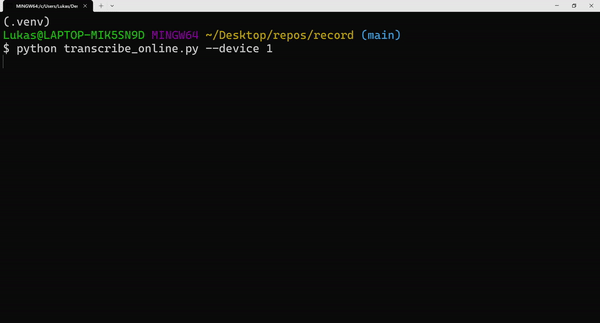

# Streaming ASR

Live ASR using faster-whisper and whisper_streaming:

Get list of available devices:

`python transcribe_online.py --devices`

Start transcribing:

`python transcribe_online.py --device 1`

Adopted from:
https://github.com/ufal/whisper_streaming/tree/main
